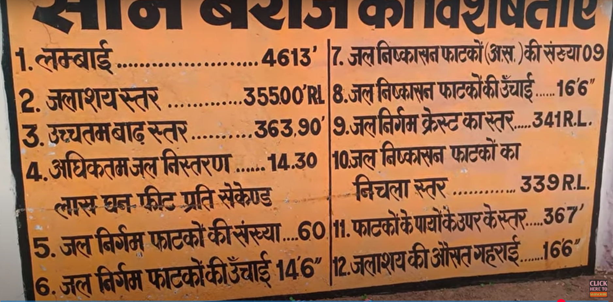
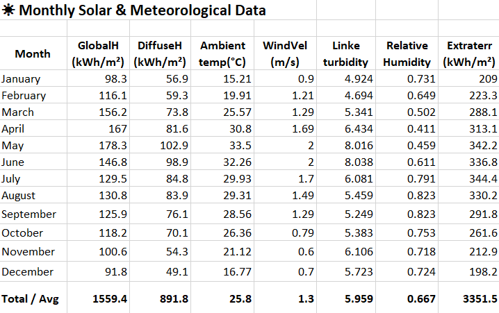
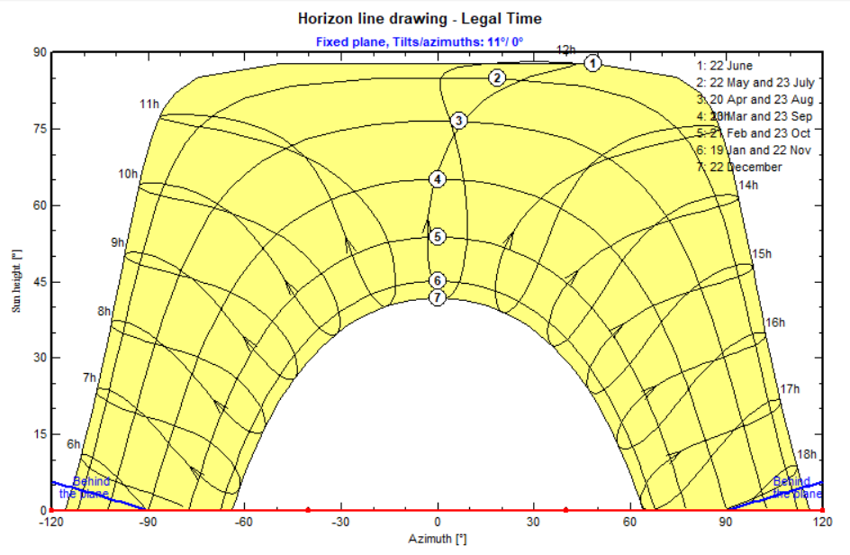
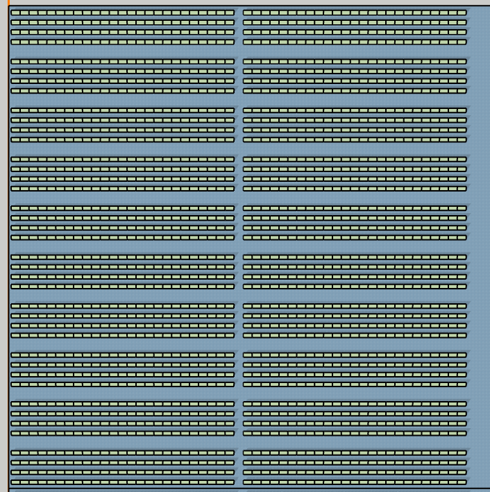
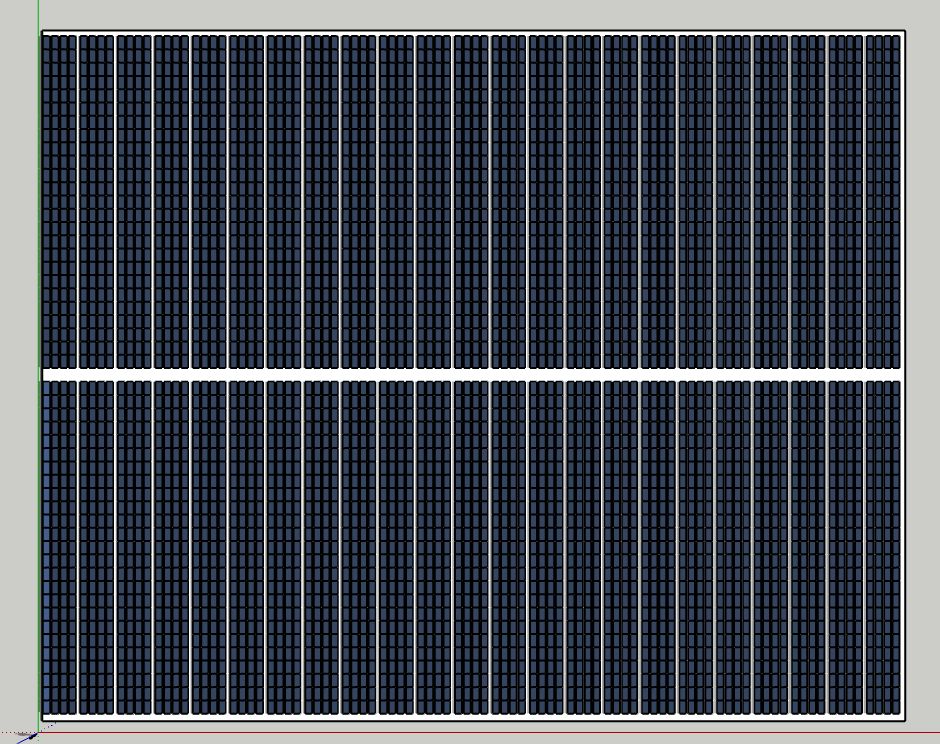
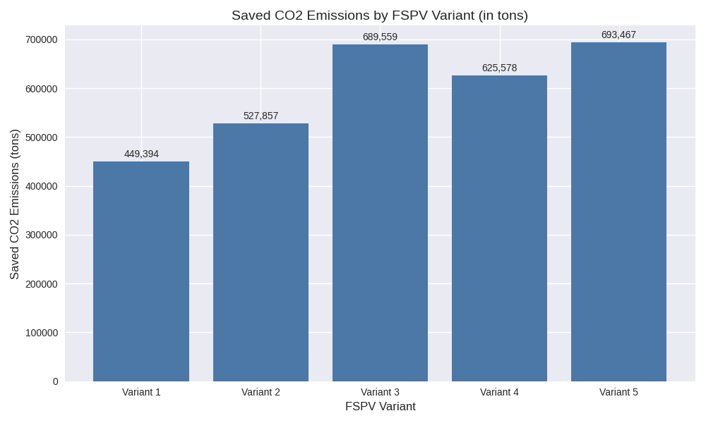

# Design and Performance analysis of a Floating solar plant.

> ⚠️ **Notice:** This repository is maintained by the owner and is read-only for public viewers.  
> Direct edits to files (including `README.md`) are restricted.  
> To suggest improvements or contribute, please open an issue or submit a pull request for review.

## 📑 Table of Contents

1. [Project Overview](#project-overview)  
2. [Proposed Site](#proposed-site)  
3. [Design Methodology](#design-methodology)  
4. [Different Variants](#different-variants)
   - [FSPV Variant 1 (VC0)](#fspv-variant-1-vc0-specifications) 
   - [FSPV Variant 2 (VC1)](#fspv-variant-2-vc1-specifications)
   - [FSPV Variant 3 (VC2)](#fspv-variant-3-vc2-specifications)
   - [FSPV Variant 4 (VC3)](#fspv-variant-4-vc3-specifications)
   - [FSPV Variant 5 (VC4)](#fspv-variant-5-vc4-specification)
5. [Performance Result](#performance-result)
   - [FSPV Variant 1 — Electrical Output](#fspv-variant-1-electrical-output)
   - [FSPV Variant 2 — Electrical Output](#fspv-variant-2-electrical-output)
   - [FSPV Variant 3 — Electrical Output](#fspv-variant-3-electrical-output)
   - [FSPV Variant 4 — Electrical Output](#fspv-variant-4-electrical-output)
   - [FSPV Variant 5 — Electrical Output](#fspv-variant-5-electrical-output)
7. [Environmental Impact](#environmental-impact)  
8. [Comparative Analysis](#comparative-analysis)
9. [Conclusion](#conclusion)

## Project-overview
With the rising demand for clean energy and increasing pressure on land resources, Floating Solar Photovoltaic (FSPV) systems have emerged as a promising alternative to conventional land-based solar installations. India, with its vast network of reservoirs, lakes, and water bodies, has witnessed a surge in FSPV adoption, driven by government initiatives and the need to optimize space utilization in densely populated regions.

This project explores the design and analysis of a 20/22.5 MWp floating solar plant proposed for deployment on Indrapuri barrage in Rohtas, Bihar, India. Unlike traditional ground-mounted systems, FSPV installations offer distinct advantages: they eliminate land acquisition challenges, reduce evaporation losses from water surfaces, and benefit from enhanced energy yield due to reduced ambient temperatures and minimal shading.

The study outlines multiple FSPV variants based on their design layouts and orientations tailored to the proposed site conditions. It evaluates the electrical performance,  and environmental impact of the floating system. The design methodology incorporates site-specific constraints, platform stability, and optimal tilt angles to ensure reliable and efficient energy generation.

  <table>
  <tr>
    <td></td>
    <td></td>
  </tr>
  <tr>
    <td align="center"><em>Figure 1: Indrapuri Barrage, Rohtas, Bihar</em></td>
    <td align="center"><em>Figure 2: Google Earth View of the Site</em></td>
  </tr>
  </table>

  

## Proposed-site

The site chosen for the analysis is near the Indrapuri barrage, Rohtas, Bihar, India. It is located over the Sone river.The proposed location is analysed for different variants, its plant capacity and future scalability, and the electrical & performance feasibility for the plant. The geographical location of the project is as follows:  
lattitude of the proposed location- 24.83°  
longitude of the proposed location- 84.13°  
Avg. altitude of the proposed location- 105m

Also, the key hydrological data for the proposed barrage site, including average water depth, seasonal river height variations, and peak flood levels is shown in the following figure. These parameters are essential for designing a stable and resilient floating solar platform.

  

<em>Figure 3: Sone barrage specifications.</em>

## Design-methodology 

The floating solar plant design was developed based on site-specific hydrological data, seasonal water level variations, platform stability requirements, and optimal energy yield considerations. The methodology involved selecting suitable PV modules and inverters, and evaluating multiple variants based on their design layouts and orientations.

For our project, the design for the different plant layouts and the shadow analysis is done using the 3D modelling software "Sketchup" and the performance analysis for its electric and performance feasibility is done using Pvsyst 8.0.15. The PVsyst software uses the meteorological data provided below by meteonorm 8.2 for the site specific analysis and to produce tthe performance report.

  <table>
  <tr>
    <td></td>
    <td></td>
  </tr>
  <tr>
    <td align="center"><em>Figure 4: Meteorological data of the site </em></td>
    <td align="center"><em>Figure 2: Sun path of the Site</em></td>
  </tr>    
  </table>

 

The different variants of the floating solar plants are realised based on their design layout (with 1.1 MW array block and 2.5 MW array block) and their different orientations. The array block layout is made using "Sketchup" with the consideration of shadows according to the site location.

  <table>
  <tr>
    <td></td>
    <td></td>
  </tr>
  <tr>
    <td align="center"><em>Figure 4: 1.1 MW array block </em></td>
    <td align="center"><em>Figure 2: 2.5 MW array block </em></td>
  </tr>    
  </table>

 

## Different-variants
For the project, we have chosen five different variants of FSPV each with some different array layouts, orientations and power capacity output. Let's uncover it one by one:

###  FSPV Variant 1 (VC0) Specifications

####  Module Specifications

| Parameter                  | Value                                  |
|---------------------------|----------------------------------------|
| Module                    | Loom 550 Wp, Mono-Si, PERC, Half-cut  |
| Maximum Power Voltage (Vmp) | 42.74 V                              |
| Maximum Power Current (Imp) | 12.89 A                              |
| Open Circuit Voltage (Voc)  | 49.90 V                              |
| Short Circuit Current (Isc) | 13.72 A                              |
| Temp. Coefficient of Isc  | +0.048%/°C                             |
| Temp. Coefficient of Voc  | -0.270%/°C                             |
| Temp. Coefficient of Pmax | -0.350%/°C                             |

####  Inverter Specifications

| Parameter                  | Value                  |
|---------------------------|------------------------|
| Inverter                  | Sungrow SG250HX-HV20   |
| AC Output Nominal Power   | 2500 kVA               |
| AC Output Voltage         | 550 V                  |
| Max. DC Input Voltage     | 1500 V                 |
| MPPT Voltage Range        | 800 – 1300 V           |
| Max. DC Current           | 3508 A                 |
| Max. Short-circuit Current| 4800 A                 |
| Max. output  Current      | 2886 A                 |
| Efficiency (EU/CEC)       | 98.7%                  |
| Peak Efficiency           | 99%                    |

####  System Layout

| Parameter       | Value                          |
|----------------|--------------------------------|
| System Layout   | 8 arrays of 2.5 MW each             |
| Array Layout    | 184 Strings with 25 Modules each (2.553 MWp) |
| Panel Ratio     | 1.012                           |
| Orientation     | Fixed Tilt: 5° / Azimuth: 132.5° |

####  Electrical Validation Variant 1

| Parameter             | Calculation / Logic                                      | Verdict       |
|----------------------|----------------------------------------------------------|---------------|
| String Vmp           | 25 × 42.74 = 1068.5 V → within MPPT (800–1300 V)         | ✅ Compliant  |
| String Voc (cold)    | 25 × 49.90 × 1.0945 ≈ 1364 V → < Max DC (1500 V)         | ✅ Compliant  |
| Startup Voltage       | Voc = 1247.5 V → > 840 V startup                         | ✅ Compliant  |
| DC Current (MPP)     | 184 × 12.89 ≈ 2372 A → < Max DC (3508 A)                 | ✅ Compliant  |
| DC Current (Isc warm)| 184 × 13.72 × 1.0216 ≈ 2578 A → < Max SC (4800 A)        | ✅ Compliant  |
| DC/AC Ratio          | 2.53 MWp / 2.5 MVA ≈ 1.012                                | ✅ Compliant  |

###  FSPV Variant 2 (VC1) Specifications

###  Module Specifications

| Parameter                  | Value                                  |
|---------------------------|----------------------------------------|
| Module                    | Loom 550 Wp, Mono-Si, PERC, Half-cut   |
| Maximum Power Voltage (Vmp) | 42.74 V                              |
| Maximum Power Current (Imp) | 12.89 A                              |
| Open Circuit Voltage (Voc)  | 49.90 V                              |
| Short Circuit Current (Isc) | 13.72 A                              |
| Temp. Coefficient of Isc  | +0.048%/°C                             |
| Temp. Coefficient of Voc  | -0.270%/°C                             |
| Temp. Coefficient of Pmax | -0.350%/°C                             |

###  Inverter Specifications

| Parameter                  | Value                  |
|---------------------------|------------------------|
| Inverter                  | Sungrow SG2500-HV20    |
| AC Output Nominal Power   | 2500 kVA               |
| AC Output Voltage         | 550 V (+10% tolerance) |
| Nominal Frequency         | 50/60 Hz (±10%)        |
| Min. Startup Voltage      | 840 V                  |
| Max. DC Voltage           | 1500 V                 |
| MPPT Voltage Range        | 800 – 1300 V           |
| Max. DC Current           | 3508 A                 |
| Max. Short-Circuit Current| 4800 A                 |
| Max. Output Current       | 2886 A                 |
| Efficiency (EU/CEC)       | 98.7%                  |
| Peak Efficiency           | 99.0%                  |

###  System Layout

| Parameter       | Value                                      |
|----------------|--------------------------------------------|
| System Layout   | 2.5 MW array × 8                          |
| Array Layout    | 23 groups of 8 strings × 25 modules (2.53 MW) |
| Pnom Ratio      | 1.012                                     |
| Orientation     | Tilt: 22° / Azimuth: 0°                   |

#### Electrical Validation Variant 2

| Parameter             | Calculation / Logic                                      | Verdict       |
|----------------------|----------------------------------------------------------|---------------|
| String Vmp           | 25 × 42.74 = 1068.5 V → within MPPT (800–1300 V)         | ✅ Compliant  |
| String Voc (cold)    | 25 × 49.90 × 1.0945 ≈ 1364 V → < Max DC (1500 V)         | ✅ Compliant  |
| Startup Voltage       | Voc = 1247.5 V → > 840 V startup                         | ✅ Compliant  |
| DC Current (MPP)     | 184 × 12.89 ≈ 2372 A → < Max DC (3508 A)                 | ✅ Compliant  |
| DC Current (Isc warm)| 184 × 13.72 × 1.0216 ≈ 2578 A → < Max SC (4800 A)        | ✅ Compliant  |
| DC/AC Ratio          | 2.53 MWp / 2.5 MVA ≈ 1.012                                | ✅ Compliant  |

###  FSPV Variant 3 (VC2) Specifications

###  Module Specifications

| Parameter                  | Value                                  |
|---------------------------|----------------------------------------|
| Module                    | Loom 550 Wp, Mono-Si, PERC, Half-cut   |
| Maximum Power Voltage (Vmp) | 42.74 V                              |
| Maximum Power Current (Imp) | 12.89 A                              |
| Open Circuit Voltage (Voc)  | 49.90 V                              |
| Short Circuit Current (Isc) | 13.72 A                              |
| Temp. Coefficient of Isc  | +0.048%/°C                             |
| Temp. Coefficient of Voc  | -0.270%/°C                             |
| Temp. Coefficient of Pmax | -0.350%/°C                             |

###  Inverter Specifications

| Parameter                  | Value                  |
|---------------------------|------------------------|
| Inverter                  | Siemens 1090 kW        |
| DC Input Nominal Power    | 1108 kW                |
| AC Output Nominal Power   | PV1090 kVA             |
| AC Output Voltage         | 600 V (+10% tolerance) |
| Nominal Frequency         | 50/60 Hz (±10%)        |
| Max. DC Voltage           | 1500 V                 |
| MPPT Voltage Range        | 875 – 962 V            |
| Max. DC Current           | 1200 A                 |
| Max. Short-Circuit Current| 6.4 – 7 kA             |
| Max. Output Current       | 1050 A                 |
| Efficiency (EU/CEC)       | 98.8%                  |
| Peak Efficiency           | 99.0%                  |

###  System Layout

| Parameter       | Value                                      |
|----------------|--------------------------------------------|
| System Layout   | 1.1 MW array × 20                         |
| Array Layout    | 10 groups of 8 strings × 25 modules (1.1 MW) |
| Pnom Ratio      | ~1.009                                    |
| Orientation     | Tilt: 11° / Azimuth: 0°                   |

#### Electrical Validation Variant 3 with Updated MPPT Range

| Parameter             | Calculation / Logic                                      | Verdict       |
|----------------------|----------------------------------------------------------|---------------|
| String Vmp           | 25 × 42.74 = 1068.5 V → within MPPT (875–1500 V)         | ✅ Compliant  |
| String Voc (cold)    | 25 × 49.90 × 1.0945 ≈ 1364 V → < Max DC (1500 V)         | ✅ Compliant  |
| Startup Voltage       | Voc = 1247.5 V → > 875 V startup                         | ✅ Compliant  |
| DC Current (MPP)     | 80 × 12.89 ≈ 1031 A → < Max DC (1200 A)                  | ✅ Compliant  |
| DC Current (Isc warm)| 80 × 13.72 × 1.0216 ≈ 1121 A → < Max SC (6400–7000 A)    | ✅ Compliant  |
| DC/AC Ratio          | 1.1 MWp / 1.09 MVA ≈ 1.01                                 | ✅ Compliant  |

###  FSPV Variant 4 (VC3) Specifications

###  Module Specifications

| Parameter                  | Value                                  |
|---------------------------|----------------------------------------|
| Module                    | Loom 550 Wp, Mono-Si, PERC, Half-cut   |
| Maximum Power Voltage (Vmp) | 42.74 V                              |
| Maximum Power Current (Imp) | 12.89 A                              |
| Open Circuit Voltage (Voc)  | 49.90 V                              |
| Short Circuit Current (Isc) | 13.72 A                              |
| Temp. Coefficient of Isc  | +0.048%/°C                             |
| Temp. Coefficient of Voc  | -0.270%/°C                             |
| Temp. Coefficient of Pmax | -0.350%/°C                             |

###  Inverter Specifications

| Parameter                  | Value                  |
|---------------------------|------------------------|
| Inverter                  | Siemens 1000 kW        |
| DC Input Nominal Power    | 1016 kW                |
| AC Output Nominal Power   | PV1000 kVA             |
| AC Output Voltage         | 550 V (+10% tolerance) |
| Nominal Frequency         | 50/60 Hz (±10%)        |
| Max. DC Voltage           | 1500 V                 |
| MPPT Voltage Range        | 802 – 882 V            |
| Max. DC Current           | 1200 A                 |
| Max. Short-Circuit Current| 6.4 – 7 kA             |
| Max. Output Current       | 1050 A                 |
| Efficiency (EU/CEC)       | 98.8%                  |
| Peak Efficiency           | 99.0%                  |

###  System Layout

| Parameter       | Value                                      |
|----------------|--------------------------------------------|
| System Layout   | 1.1 MW array × 20                         |
| Array Layout    | 10 groups of 8 strings × 25 modules (1.1 MW) |
| Pnom Ratio      | 1.1                                       |
| Orientation     | Tilt: 15° / Azimuth: 0°                   |

#### Electrical Validation Variant 4 with Updated MPPT Range

| Parameter               | Calculation / Logic                                           | Verdict       |
|------------------------|---------------------------------------------------------------|---------------|
| String Vmp             | 25 × 42.74 = 1068.5 V → within MPPT (802–1500 V)             | ✅ Compliant  |
| String Voc (cold)      | 25 × 49.90 × 1.0945 ≈ 1364 V → < Max DC (1500 V)             | ✅ Compliant  |
| Startup Voltage        | Voc = 1247.5 V → > typical startup threshold                  | ✅ Compliant  |
| DC Current (at MPP)    | 80 × 12.89 ≈ 1031 A → < Max DC (1200 A)                       | ✅ Compliant  |
| DC Current (Isc warm)  | 80 × 13.72 × 1.0216 ≈ 1121 A → < Max SC (6.4–7 kA)            | ✅ Compliant  |
| DC/AC Ratio            | (80 × 25 × 0.55) = 1.10 MWp / 1.0 MVA ≈ 1.10                  | ✅ Compliant  |

###  FSPV Variant 5 (VC4) Specifications

###  Module Specifications

| Parameter                  | Value                                  |
|---------------------------|----------------------------------------|
| Module                    | Loom 550 Wp, Mono-Si, PERC, Half-cut   |
| Maximum Power Voltage (Vmp) | 42.74 V                              |
| Maximum Power Current (Imp) | 12.89 A                              |
| Open Circuit Voltage (Voc)  | 49.90 V                              |
| Short Circuit Current (Isc) | 13.72 A                              |
| Temp. Coefficient of Isc  | +0.048%/°C                             |
| Temp. Coefficient of Voc  | -0.270%/°C                             |
| Temp. Coefficient of Pmax | -0.350%/°C                             |

###  Inverter Specifications

| Parameter                  | Value                  |
|---------------------------|------------------------|
| Inverter                  | Sungrow SG2500-HV20    |
| AC Output Nominal Power   | 2500 kVA               |
| AC Output Voltage         | 550 V (+10% tolerance) |
| Nominal Frequency         | 50/60 Hz (±10%)        |
| Min. Startup Voltage      | 840 V                  |
| Max. DC Voltage           | 1500 V                 |
| MPPT Voltage Range        | 800 – 1300 V           |
| Max. DC Current           | 3508 A                 |
| Max. Short-Circuit Current| 4800 A                 |
| Max. Output Current       | 2886 A                 |
| Efficiency (EU/CEC)       | 98.7%                  |
| Peak Efficiency           | 99.0%                  |

###  System Layout

| Parameter       | Value                                      |
|----------------|--------------------------------------------|
| System Layout   | 2.5 MW array × 9                         |
| Array Layout    | 23 groups of 8 strings × 25 modules (2.53 MW) |
| Pnom Ratio      | 1.012                                     |
| Orientation     | Tilt: 11° / Azimuth: 0°                   |

### Electrical Validation Variant 5

| Parameter             | Calculation / Logic                                      | Verdict       |
|----------------------|----------------------------------------------------------|---------------|
| String Vmp           | 25 × 42.74 = 1068.5 V → within MPPT (800–1300 V)         | ✅ Compliant  |
| String Voc (cold)    | 25 × 49.90 × 1.0945 ≈ 1364 V → < Max DC (1500 V)         | ✅ Compliant  |
| Startup Voltage       | Voc = 1247.5 V → > 840 V startup                         | ✅ Compliant  |
| DC Current (MPP)     | 184 × 12.89 ≈ 2372 A → < Max DC (3508 A)                 | ✅ Compliant  |
| DC Current (Isc warm)| 184 × 13.72 × 1.0216 ≈ 2578 A → < Max SC (4800 A)        | ✅ Compliant  |
| DC/AC Ratio          | 2.53 MWp / 2.5 MVA ≈ 1.012                                | ✅ Compliant  |

## Performance results

### FSPV Variant 1 Electrical Output

| Parameter               | Value         |
|------------------------|---------------|
| Nominal PV Power       | 20.24 MWp     |
| Annual Production      | 23,387 MWh/yr |
| Specific Yield         | 1156 kWh/kWp/yr |
| Performance Ratio      | 75.4%         |
| Array Loss             | 0.84 kWh/kWp/day |
| System Loss            | 0.20 kWh/kWp/day |

###  FSPV Variant 2 Electrical Output

| Parameter               | Value         |
|------------------------|---------------|
| Nominal PV Power       | 20.24 MWp     |
| Annual Production      | 23,183 MWh/yr |
| Specific Yield         | 1145 kWh/kWp/yr |
| Performance Ratio      | 70.4%         |
| Array Loss             | 1.14 kWh/kWp/day |
| System Loss            | 0.10 kWh/kWp/day |

###  FSPV Variant 3 Electrical Output

| Parameter               | Value         |
|------------------------|---------------|
| Nominal PV Power       | 22.00 MWp     |
| Annual Production      | 28,419 MWh/yr |
| Specific Yield         | 1292 kWh/kWp/yr |
| Performance Ratio      | 80.3%         |
| Array Loss             | 0.77 kWh/kWp/day |
| System Loss            | 0.11 kWh/kWp/day |

### FSPV Variant 4 Electrical Output

| Parameter               | Value         |
|------------------------|---------------|
| Nominal PV Power       | 22.00 MWp     |
| Annual Production      | 27,325 MWh/yr |
| Specific Yield         | 1242 kWh/kWp/yr |
| Performance Ratio      | 76.5%         |
| Array Loss             | 0.91 kWh/kWp/day |
| System Loss            | 0.13 kWh/kWp/day |

### FSPV Variant 5  Electrical Output

| Parameter               | Value         |
|------------------------|---------------|
| Nominal PV Power       | 22.77 MWp     |
| Annual Production      | 30,170 MWh/yr |
| Specific Yield         | 1325 kWh/kWp/yr |
| Performance Ratio      | 82.1%         |
| Array Loss             | 0.73 kWh/kWp/day |
| System Loss            | 0.06 kWh/kWp/day |

## Environmental impact

Floating Solar Photovoltaic (FSPV) systems offer a promising renewable energy solution with notable environmental benefits. By utilizing water surfaces instead of land, FSPVs help preserve terrestrial ecosystems and reduce land-use conflicts. They can also lower water evaporation rates and improve panel efficiency due to the cooling effect of water. While some can debate about the impacts on the marine ecosysytem by the installation on water bodies but researches till now had shown a very minimal disturbance results. Also being a renewable source of energy it offers the advantages of minimal contribution to the green house gases emmmisions. The figure attached below is a  bar graph based on simulation result of approximate saved CO2 emmisions over a lifespan of 25 years by different variants of the project.

  

<em>Figure 3: Saved CO2 emissions over 25 years lifespan.</em>

## Comparative Analysis 

| **Parameter**              | **FSPV (20 MW)**                          | **Land-Based Solar PV (20 MW)**           | **Thermal Plant (22.5 MW)**                     |
|---------------------------|-------------------------------------------|--------------------------------------------|--------------------------------------------------|
| Produced Energy (Annual)  | ~22000 MWh/year                          | ~30000 MWh/year                    | ~157,680 MWh/year (PLF ~80%)                     |
| Performance Ratio (PR)    | ~75–80%                                   | ~76–86%                                    | ~35–40% (thermal efficiency)                     |
| Saved CO₂ Emission        | ~20,000 tons/year                         | ~13,600–15,000 tons/year                   | Emits ~142,000 tons/year                         |
| Cost of Plant             | ₹80–90 crore          | ₹95–100 crore           | ₹270–300 crore                 |

