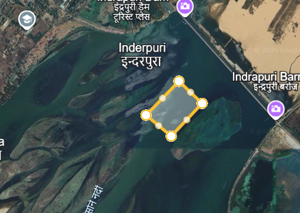

# Design and Performance analysis of Floating solar plant.

## 📚 Table of Contents
1. [Project Overview](#Project-overview)
2. [Proposed Site](#Proposed-site)
3. [Design Methodology](#Design-methodology)
4. [Tools & Technologies](#tools--technologies)
5. [Environmental Impact](#environmental-impact)
7. [Data & Files](#data--files)

## Project-overview
With the rising demand for clean energy and increasing pressure on land resources, Floating Solar Photovoltaic (FSPV) systems have emerged as a promising alternative to conventional land-based solar installations. India, with its vast network of reservoirs, lakes, and water bodies, has witnessed a surge in FSPV adoption, driven by government initiatives and the need to optimize space utilization in densely populated regions.

This project explores the design and analysis of a 20/22.5 MWp floating solar plant proposed for deployment on Indrapuri barrage in Rohtas, Bihar, India. Unlike traditional ground-mounted systems, FSPV installations offer distinct advantages: they eliminate land acquisition challenges, reduce evaporation losses from water surfaces, and benefit from enhanced energy yield due to reduced ambient temperatures and minimal shading.

The study outlines multiple FSPV variants based on their design layouts and orientations tailored to the proposed site conditions. It evaluates the electrical performance,  and environmental impact of the floating system. The design methodology incorporates site-specific constraints, platform stability, and optimal tilt angles to ensure reliable and efficient energy generation.

  <table>
  <tr>
    <td></td>
    <td></td>
  </tr>
  <tr>
    <td align="center"><em>Figure 1: Indrapuri Barrage, Rohtas, Bihar</em></td>
    <td align="center"><em>Figure 2: Google Earth View of the Site</em></td>
  </tr>
  </table>

  

## Proposed-site

The site chosen for the analysis is near the Indrapuri barrage, Rohtas, Bihar, India. It is located over the Sone river.The proposed location is analysed for different variants, its plant capacity and future scalability, and the electrical & performance feasibility for the plant. The geographical location of the project is as follows:  
lattitude of the proposed location- 24.83°  
longitude of the proposed location- 84.13°  
Avg. altitude of the proposed location- 105m

Also, the key hydrological data for the proposed barrage site, including average water depth, seasonal river height variations, and peak flood levels is shown in the following figure. These parameters are essential for designing a stable and resilient floating solar platform.

  

<em>Figure3: Sone barrage specifications.</em>

## Design-methodology 

The floating solar plant design was developed based on site-specific hydrological data, seasonal water level variations, platform stability requirements, and optimal energy yield considerations.  
The methodology involved selecting suitable PV modules and inverters, and evaluating multiple variants based on their design layouts and orientations.

For our project, the design for the different plant layouts and the shadow analysis is done using the 3D modelling software "Sketchup" and the performance analysis for its electric and performance feasibility is done using Pvsyst 8.0.15.
The PVsyst software uses the meteorological data provided by meteonorm 8.2 for the site specific analysis.

